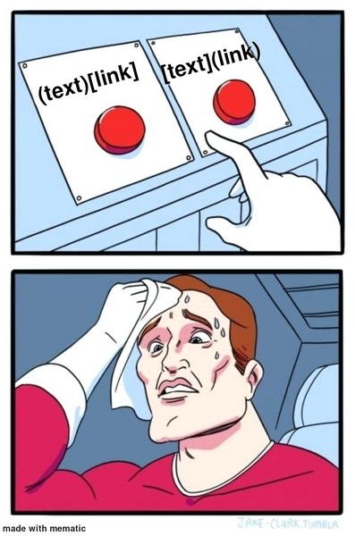

# The Markdown markup language 

Markdown is a lightweight markup language for creating formatted text using a plain-text editor.  It was created by John Gruber and Aaron Swartz in 2004.  It has become a popular format for writing documentation for code.

*   A *markup language* describes the appearance of a rich document only using plain text.
    *   A *rich document* presents text using different fonts, colors and styles, and possibly includes images and other multi-media elements
        *   e.g. a Word document or a webpage
*   HTML is a common markup language, but is hard to read in its raw form
    *   Markdown aims to produce documents that are readable to humans in their raw form, and simple to convert into HTML.

This document introduces the most basic features of Markdown.  Much more is possible, but will be left to you to study on your own.

## Headers

*   Begin a line of text with consecutive `#` to introduce a header.
*   Markdown defines six (6) levels of header, using from 1 to 6 `#`'s
    *   Lower level headers are presented in smaller fonts

# This is a level 1 Header
## This is a level 2 Header
### This is a level 3 Header
#### This is a level 4 Header
##### This is a level 5 Header
###### This is a level 6 Header

```
# This is a level 1 Header
## This is a level 2 Header
### This is a level 3 Header
#### This is a level 4 Header
##### This is a level 5 Header
###### This is a level 6 Header
```


## Paragraphs

Consecutive lines of text are formed into paragraphs.
Lines of text in paragraphs can be as long
or as short
as you want.

Separate paragraphs with one or more blank lines.
Inside paragraphs you can write **bold text** by surrounding words with two asterisks, `**`.
_Italicized text_ is surrounded by single underlines `_`.
~~Struck through text~~ is surrounded by double tildes `~~`.
A `code span` is created by surrounding text with a back-tick `` ` ``
(**_Hint_**: back-tick shares the same key as `~`).

```
Consecutive lines of text are formed into paragraphs.
Lines of text in paragraphs can be as long
or as short
as you want.

Separate paragraphs with one or more blank lines.
Inside paragraphs you can write **bold text** by surrounding words with two asterisks, `**`.
_Italicized text_ is surrounded by single underlines `_`.
~~Struck through text~~ is surrounded by double tildes `~~`.
A `code span` is created by surrounding text with a back-tick `` ` ``
(**_Hint_**: back-tick shares the same key as `~`).
```


## Pre-formatted Code Blocks

Unlike paragraphs, pre-formatted code blocks preserve your indentation and spacing *exactly*.

The following is intentionally redundant; first you will see an example of a code block followed by a code block that shows how I made the code block.

```
Pre-formatted
    blocks
        of
            text
        (i.e. code blocks)
            Are made by indenting a block of text by four spaces,
                or fencing a block of text with triple back-ticks ```
            or with triple tildes ~~~

A fence is a line that starts with and contains only 3 of the same character:

~~~
For example,
I'm surrounded by a fence of triple tildes
~~~
```


    ```
    Pre-formatted
        blocks
            of
                text
            (i.e. code blocks)
                Are made by indenting a block of text by four spaces,
                    or fencing a block of text with triple back-ticks ```
                or with triple tildes ~~~

    A fence is a line that starts with and contains only 3 of the same character:

    ~~~
    For example,
    I'm surrounded by a fence of triple tildes
    ~~~
    ```


If GitLab knows about your programming language, it can present code with
**syntax highlighting**.  Write the name of the programming language
immediately after the opening triple-backquote, like this: `` ```python ``.

```python
# you can even
def code_blocks(with, programming, language, syntax, highlighting)
    """
    by writing the name of the programming language
    after the first triple-character fence
    """
    if this == pretty_cool:
        return True
```

    ```python
    # you can even
    def code_blocks(with, programming, language, syntax, highlighting)
        """
        by writing the name of the programming language
        after the first triple-character fence
        """
        if this == pretty_cool:
            return True
    ```


## Tables

| Tables | with     | columns |
|--------|----------|---------|
| can    | be       | made    |
| with   | pipes,   | spaces, |
| and    | a        | lot     |
| of     | patience | !       |
| The    | important| thing   |
| is     | that     | the     |
| line   | following| the     |
| header | consists | of      |
| dashes | .        |         |


```
| Tables | with     | columns |
|--------|----------|---------|
| can    | be       | made    |
| with   | pipes,   | spaces, |
| and    | a        | lot     |
| of     | patience | !       |
| The    | important| thing   |
| is     | that     | the     |
| line   | following| the     |
| header | consists | of      |
| dashes | .        |         |
```


## Lists

*   Bulleted
*   lists
    *   may contain
    *   indented
    *   sub-lists
*   and are started with
    *   `*` Asterisks
    *   `+` Plus Signs
    *   `-` Minus Signs

```
*   Bulleted
*   lists
    *   may contain
    *   indented
    *   sub-lists
*   and are started with
    *   `*` Asterisks
    *   `+` Plus Signs
    *   `-` Minus Signs
```


1.  Numbered
2.  lists
    *   may also contain
    *   indented
    *   sub-lists
    *   bulleted or numbered are both okay
3.  and are started with
    1.  Numbers followed by a period `.`
    2.  Begin numbered sub-lists from `1.`

```
1.  Numbered
2.  lists
    *   may also contain
    *   indented
    *   sub-lists
    *   bulleted or numbered are both okay
3.  and are started with
    1.  Numbers followed by a period `.`
    2.  Begin numbered sub-lists from `1.`
```

## Hyperlinks

[Hyperlinks](https://developer.mozilla.org/en-US/docs/Learn/Common_questions/What_are_hyperlinks) are an important feature of the [World Wide Web](https://developer.mozilla.org/en-US/docs/Glossary/World_Wide_Web).  These are written in two parts:

1.  Surround the text of the link with square brackets `[]`
2.  Surround the address in parentheses `()`
3.  All together, it looks like `[this](http://example.com/)`...
4.  ...And works like [this](http://example.com/)


## Images

Images are like Hyperlinks that start with a `!`.

1.  Within the square brackets `![]` write the alt-text for the image
    *   The *alt-text* is shown when the image cannot be loaded or displayed
2.  Write the address of the image surrounded by parentheses `()`
    *   **Optional** within the parentheses you may also write a *title* for the image as a quoted string
    *   The *title* is the text shown when your mouse hovers over the image
3.  All together, it looks like this ``
4.  ...And works like this:
    *   


## Markdown Hints

I **do not** recommend that you write Markdown directly in GitLab's Web IDE.  Although GitLab has a preview feature, it creates problems when syncing your code between the server and your computer.

PyCharm and VS Code can display a live preview of Markdown files.  If you want to see what your Markdown files will look like as you write, this is the best way to go.


## More resources

*   [The Markdown Guide](https://www.markdownguide.org/) a free and open-source reference guide
*   [GitLab Flavored Markdown](https://gitlab.cs.usu.edu/help/user/markdown.md) describes how Markdown works on this site
*   [Markdown on John Gruber's Blog](https://daringfireball.net/projects/markdown/) straight from the horse's mouth
